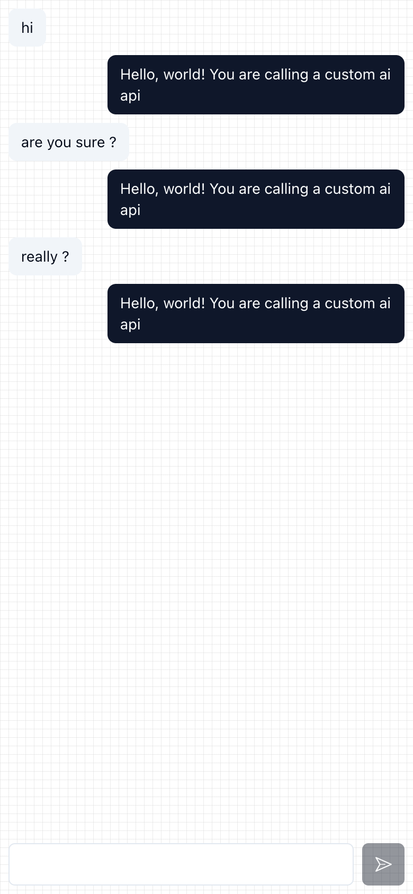

# xyzchat 项目

## Prerequisites

You better have solid understanding of the following technologies:

- [React](https://reactjs.org/)

You should also have a basic understanding of the following technologies:

- [Next.js](https://nextjs.org/)
- [TypeScript](https://www.typescriptlang.org/)
- [Tailwind CSS](https://tailwindcss.com/)
- [Turbo](https://turbo.hotwired.dev/)
- [Storybook](https://storybook.js.org/)
- [Radix UI](https://radix-ui.com/)
- [Shadcn UI](https://ui.shadcn.com/)
- [AI SDK](https://sdk.vercel.ai/)

Nevertheless, you can still follow along if you are willing to learn.

- Firstly you would find the biz logic in mobile app only has 100 lines of code.

  This is because the details are hidden in the core components as well as blah project.

- Secondly you would find component development is separated from the mobile app.

  Even it seems over-engineering, but I find engineer tend to have a good interface design unconsciously.

## screenshot



## How to setup

> This is a monorepo project driven by turbo

```bash
pnpm install
```

## How to build

```bash
pnpm build
```

## How to dev

- components

```bash
pnpm dev:component
```

- mobile app

```bash
pnpm build    # build the core & blah projects
pnpm mock     # start mock server
pnpm dev      # start mobile app
```

## 项目目标

- 对于 AI Chatbot 的不断探索 吸纳主流 Chatbot 开发技术
- 在 设计系统层面 进行 横向的扩展
- 基于 AI SDK 的 custom provider 提供模型的扩展

## 设计思想

- 第一性原理

  - 拆解问题：将复杂的问题分解成更小、更基本的部分。
  - 寻找基本事实：找到这些部分中最基本、最确定的事实和原理。
  - 重建解决方案：基于这些基本事实和原理，重新构建解决方案，而不是依赖现有的假设和惯例。

- 大道至简

  - 苹果和特斯拉的成功就是简化了复杂的事物, 将复杂度从用户的角度进行了转移

- 无处不代理

  - 代理模式可以降低 耦合度
  - 代理的泛化
    - 代理的目的是为了解耦, 但是代理的实现可以是多种多样的 简而言之 不直接依赖 间接依赖就是代理

- 不要轻易深入到细节设计, 先完成最重要的设计

  - 细节可以后续再设计与优化

## 技术实现

- 设计系统 与 组件库

  - radix ui
  - shadcn/ui
  - storybook

- 聊天应用
  - ai sdk
  - next.js

## 项目结构

```
.
├── README.md
├── apps
│   ├── mobile                      # mobile app
│   └── mock-api                    # mock the custom ai api server
├── deploy.sh
├── docs                            # docs
├── package.json
├── packages
│   ├── blah                        # AI SDK custom provider
│   └── core                        # core ui components
├── pnpm-lock.yaml
├── pnpm-workspace.yaml
└── turbo.json
```

## 工作流

整个项目的需求是如何推进的, 类似于里程碑, 参考 [flow](./docs/flow.md)

## 改进项目

整个项目的推进以业务优先, 但是一些改进项目也需要跟踪, 参考 [todo](./docs/todo.md)
